# 🚀 Sands Automation Framework

[](https://www.oracle.com/java/)
[](https://www.selenium.dev/)
[](https://playwright.dev/)
[](https://cucumber.io/)
[](https://maven.apache.org/)
[](https://opensource.org/licenses/Apache-2.0)

Enterprise-grade test automation framework supporting **Web**, **API**, **Mobile**, **Desktop**, and **Mainframe** testing with unified reporting and BDD approach.

---

## 📋 Table of Contents

- [Architecture Overview](#architecture-overview)
- [Core Components](#core-components)
- [Multi-Project Integration](#multi-project-integration)
- [Framework Selection Guide](#framework-selection-guide)
- [Key Features](#key-features)
- [Quick Start](#quick-start)
- [Project Structure](#project-structure)
- [Configuration](#configuration)
- [Running Tests](#running-tests)
- [Reports](#reports)
- [Documentation](#documentation)
- [Contributing](#contributing)

---

## 🏗️ Architecture Overview

```mermaid
graph TB
    subgraph CI["🔄 CI/CD Pipeline - GitHub Actions"]
        GH["GitHub Actions<br/>Automated Builds & Tests"]
    end

    subgraph CORE["🎯 Core Framework - SandsAutoFramework (JAR Dependency)"]
        direction LR
        SEL["Selenium<br/>Web Automation"]
        PW["Playwright<br/>Modern Web"]
        API["REST API<br/>RestAssured"]
        MOB["Mobile<br/>Appium"]
        DESK["Desktop<br/>WinAppDriver"]
        MF["Mainframe<br/>EHLLAPI"]
    end

    subgraph PROJECTS["📦 Application Test Projects (Separate Repositories)"]
        direction TB
        
        subgraph P1["Casino Credit System"]
            CCS1["🎰 Web UI Tests"]
            CCS2["🔌 API Tests"]
            CCS3["📊 E2E Workflows"]
        end
        
        subgraph P2["Smart Approver"]
            SA1["✅ Approval Workflows"]
            SA2["🔔 Notification Tests"]
            SA3["📱 Mobile App"]
        end
        
        subgraph P3["PAP - Patron Association Portal"]
            PAP1["🌐 Web Portal"]
            PAP2["🔐 Auth Tests"]
            PAP3["👥 Patron Management"]
        end
        
        subgraph P4["Middleware API"]
            MW1["🔗 Integration Tests"]
            MW2["⚡ Performance Tests"]
            MW3["🔒 Security Tests"]
        end
        
        subgraph P5["IGPOS Desktop"]
            IG1["🖥️ Desktop App"]
            IG2["🗳 Mainframe Integration"]
            IG3["💰 POS Workflows"]
        end
        
        subgraph P6["ACSC Mainframe"]
            ACSC1["🗳 3270 Terminal"]
            ACSC2["📊 Credit Workflows"]
            ACSC3["🔄 Batch Processing"]
        end
    end

    subgraph REPORTS["📊 Unified Reporting & Artifacts"]
        direction LR
        EXT["📈 ExtentReports"]
        ALL["📉 Allure Reports"]
        CUST["📄 Custom HTML"]
        LOGS["📝 Logs & Screenshots"]
    end

    GH -->|Triggers Build| CORE
    CORE -->|JAR Dependency| P1
    CORE -->|JAR Dependency| P2
    CORE -->|JAR Dependency| P3
    CORE -->|JAR Dependency| P4
    CORE -->|JAR Dependency| P5
    CORE -->|JAR Dependency| P6
    
    P1 -->|Generates| REPORTS
    P2 -->|Generates| REPORTS
    P3 -->|Generates| REPORTS
    P4 -->|Generates| REPORTS
    P5 -->|Generates| REPORTS
    P6 -->|Generates| REPORTS
    
    REPORTS -->|Publishes to| GH

    style CI fill:#24292e,stroke:#0366d6,stroke-width:3px,color:#fff
    style CORE fill:#667eea,stroke:#764ba2,stroke-width:4px,color:#fff
    style PROJECTS fill:#f8f9fa,stroke:#6c757d,stroke-width:2px
    style REPORTS fill:#27ae60,stroke:#229954,stroke-width:3px,color:#fff
```



---

## 🎯 Core Components

### 1️⃣ **DriverManager** - Multi-Framework Driver Management
Thread-safe driver lifecycle management for all automation types.

```java
// Selenium WebDriver
WebDriver driver = DriverManager.getSeleniumDriver();

// Playwright Page
Page page = DriverManager.getPlaywrightPage();

// Appium Mobile Driver
AppiumDriver mobileDriver = DriverManager.getAppiumDriver();

// Windows Desktop Driver
WindowsDriver desktopDriver = DriverManager.getWindowsDriver();

// Mainframe Driver
MainFrameDriver mainframeDriver = DriverManager.getMainframeDriver();
```

**Key Features:**
- ✅ ThreadLocal pattern for parallel execution
- ✅ Automatic driver initialization based on config
- ✅ Graceful cleanup and resource management
- ✅ Support for local and remote execution

---

### 2️⃣ **ConfigManager** - Centralized Configuration
Singleton pattern for managing all framework configurations.

```java
// Load configuration
ConfigManager.loadConfig();

// Get properties
String browser = ConfigManager.getProperty("browser");
int timeout = ConfigManager.getIntProperty("explicit.wait");
boolean headless = ConfigManager.getBooleanProperty("headless");

// Environment-specific config
ConfigManager.loadEnvironmentConfig("qa");
```

**Configuration Files:**
- `config.properties` - Global settings
- `qa.properties` - QA environment
- `uat.properties` - UAT environment
- `prod.properties` - Production environment

---

### 3️⃣ **UnifiedLogger** - Single Logging Interface
One logging call logs to all reporting systems simultaneously.

```java
UnifiedLogger.info("Test started");
UnifiedLogger.action("Click", "Login Button");
UnifiedLogger.pass("Login successful");
UnifiedLogger.fail("Expected element not found");
UnifiedLogger.warning("Slow response time detected");
```

**Logs to:**
- 📝 LogManager (File logs)
- 📄 CustomReporter (HTML Report)
- 📈 ExtentReports (Interactive Dashboard)
- 📉 Allure (Trend Analysis)

---

### 4️⃣ **ScenarioContext** - Thread-Safe Data Sharing
Share data between Cucumber steps with type safety.

```java
// Store data
ScenarioContext.set("username", "testuser");
ScenarioContext.set("cartCount", 5);
ScenarioContext.set("orderTotal", 199.99);

// Retrieve data with type safety
String username = ScenarioContext.get("username", String.class);
Integer count = ScenarioContext.get("cartCount", Integer.class);
Double total = ScenarioContext.get("orderTotal", Double.class);

// Clear context
ScenarioContext.clear();
```

**Features:**
- ✅ Thread-safe for parallel execution
- ✅ Type-safe retrieval
- ✅ Automatic cleanup after scenario
- ✅ Variable substitution in step definitions `${variableName}`

---

### 5️⃣ **APIClient** - REST & SOAP API Testing
Simplified API testing with RestAssured.

```java
// Initialize
APIClient.initialize("https://api.example.com");

// Send requests
Response response = APIClient.get("/users/1");
Response response = APIClient.post("/users", requestBody);
Response response = APIClient.put("/users/1", updateBody);
Response response = APIClient.delete("/users/1");

// Add headers
APIClient.addHeader("Authorization", "Bearer token");
APIClient.addHeader("Content-Type", "application/json");

// Validations
int statusCode = APIClient.getStatusCode();
String body = APIClient.getResponseBody();
String value = APIClient.getJsonPath("data.name");
```

**Supports:**
- ✅ REST APIs (GET, POST, PUT, DELETE, PATCH)
- ✅ SOAP APIs with XML
- ✅ Authentication (Bearer, Basic, OAuth2)
- ✅ JSON/XML validation
- ✅ Schema validation

---

### 6️⃣ **AssertUtils** - Unified Assertion Framework
Centralized assertions with automatic logging.

```java
// Hard assertions (fail immediately)
AssertUtils.assertEquals(actual, expected, "Values should match");
AssertUtils.assertTrue(condition, "Condition should be true");
AssertUtils.assertNotNull(object, "Object should not be null");

// Soft assertions (collect all failures)
AssertUtils.enableSoftAssert();
AssertUtils.assertEquals(value1, expected1, "Check 1");
AssertUtils.assertEquals(value2, expected2, "Check 2");
AssertUtils.assertEquals(value3, expected3, "Check 3");
AssertUtils.assertAll(); // Fail if any assertion failed
```

**Features:**
- ✅ Auto-logging to all reports
- ✅ Hard and soft assertion modes
- ✅ Custom error messages
- ✅ Screenshot on failure

---

### 7️⃣ **Reusable Classes** - Framework-Specific Methods

#### **SeleniumReusable** - Selenium Operations
```java
public class LoginPage extends SeleniumReusable {
    public void login(String username, String password) {
        type(usernameField, username);
        type(passwordField, password);
        click(loginButton);
        waitForElement(dashboard);
    }
}
```

#### **PlaywrightReusable** - Playwright Operations
```java
public class LoginPage extends PlaywrightReusable {
    public void login(String username, String password) {
        type(locator("#username"), username);
        type(locator("#password"), password);
        click(locator("#loginBtn"));
        assertVisible(locator(".dashboard"));
    }
}
```

#### **MobileReusable** - Mobile Operations
```java
public class MobileHomePage extends MobileReusable {
    public void navigateToProfile() {
        tap(profileIcon);
        swipeUp();
        waitForElement(profileDetails);
    }
}
```

#### **WindowsDesktopReusable** - Desktop Operations
```java
public class CalculatorPage extends WindowsDesktopReusable {
    public void add(int num1, int num2) {
        click(getButton(num1));
        click(plusButton);
        click(getButton(num2));
        click(equalsButton);
    }
}
```

#### **MainframeReusable** - Mainframe Operations
```java
public class MainframeLogin extends MainframeReusable {
    public void login(String userId, String password) {
        sendText(1, 10, userId);
        sendText(2, 10, password);
        sendEnter();
        waitForText("MAIN MENU");
    }
}
```

---

### 8️⃣ **Keywords Classes** - Manual QA Friendly

#### **UIKeywords** - Framework-Agnostic Web Automation
```java
UIKeywords.openBrowser();
UIKeywords.navigateToURL("https://example.com");
UIKeywords.clickElement("#loginBtn");
UIKeywords.enterText("#username", "testuser");
String text = UIKeywords.getTextFromElement(".message");
UIKeywords.closeBrowser();
```

#### **APIKeywords** - Simplified API Testing
```java
APIKeywords.initializeAPI("https://api.example.com");
APIKeywords.sendGETRequest("/users/1");
int status = APIKeywords.getResponseStatusCode();
String body = APIKeywords.getResponseBody();
APIKeywords.responseContains("John Doe");
```

---

### 9️⃣ **Reporting System** - Multi-Format Reports

#### **ExtentReports** - Interactive HTML Dashboard
- Dark theme with modern UI
- Embedded screenshots
- Category filtering
- Pass/Fail/Skip statistics

#### **Allure Reports** - Trend Analysis
- Interactive dashboard
- Timeline view
- Historical trends
- Test retries tracking

#### **CustomReporter** - Lightweight HTML
- Base64 embedded screenshots
- Pass/Fail summary
- Detailed step logs
- Fast loading

#### **Cucumber Reports** - Native BDD Reports
- Feature-wise results
- Scenario status
- Step definitions
- Tags filtering

---

### 🔟 **CucumberHooks** - Test Lifecycle Management

```java
@Before
public void setUp(Scenario scenario) {
    // Initialize driver based on tags
    // Set up scenario context
    // Start logging
}

@After
public void tearDown(Scenario scenario) {
    // Capture screenshot on failure
    // Log test results
    // Cleanup resources
    // Close driver
}

@BeforeAll
public static void beforeAll() {
    // Load configuration
    // Initialize reporters
}

@AfterAll
public static void afterAll() {
    // Generate final reports
    // Send notifications
}
```

---

## 🏢 Multi-Project Integration

### How Projects Use the Framework

Each application test project imports the framework as a **JAR dependency**:

```xml
<dependency>
    <groupId>com.automation</groupId>
    <artifactId>sands-automation-framework</artifactId>
    <version>1.0.0</version>
</dependency>
```

### Benefits:

✅ **Single Source of Truth** - Core framework maintained in one repository  
✅ **Reusability** - All projects leverage same automation capabilities  
✅ **Consistency** - Unified reporting, logging, and configuration  
✅ **Scalability** - Add new projects easily by importing the framework JAR  
✅ **Maintainability** - Framework updates automatically available to all projects  
✅ **CI/CD Ready** - GitHub Actions orchestrates builds, tests, and deployments

---

## 🎯 Framework Selection Guide

| Application Type | Examples | Recommended Library | Confidence | Why? |
|-----------------|----------|-------------------|------------|------|
| 🌐 **Modern Web Apps** | Angular, React, Vue, Casino Credit | **Playwright** | 95% | Auto-wait, native async, dynamic content |
| 🏛️ **Legacy Web Apps** | .NET, JSP, Smart Approver | **Selenium** | 90% | Mature, IE support, extensive community |
| 🏨 **CRM/ERP Systems** | Opera PMS, Salesforce, SAP | **Selenium** | 85% | Complex iframe, multiple windows |
| 🔌 **REST/SOAP APIs** | Middleware API, Microservices | **RestAssured** | 98% | BDD syntax, fast, no UI overhead |
| 📱 **Mobile Apps** | Smart Approver Mobile, PAP Mobile | **Appium** | 85% | Cross-platform, native gestures |
| 🖥️ **Windows Desktop** | POS Applications, WPF Apps | **WinAppDriver** | 80% | Native Windows, UI Automation API |
| 🖼️ **Thin Client Apps** | IGPOS (Citrix), RDP Apps | **WinAppDriver + Sikuli** | 70% | Citrix support, image recognition |
| 🗳️ **Mainframe 3270** | ACSC, CICS, IMS | **EHLLAPI** | 95% | Native protocol, very reliable |

---

## ✨ Key Features

### 🔄 Multi-Framework Support
- **Web**: Selenium 4.15.0 & Playwright 1.56.0
- **API**: RestAssured 5.3.2 (REST & SOAP)
- **Mobile**: Appium 10.0.0 (Android & iOS)
- **Desktop**: WinAppDriver (Windows Apps)
- **Mainframe**: EHLLAPI (3270 Terminal)

### 📊 Comprehensive Reporting
- ExtentReports (Interactive Dashboard)
- Allure Reports (Trend Analysis)
- CustomReporter (Lightweight HTML)
- Cucumber Reports (BDD Format)
- Unified Logging to all reports

### 🧪 BDD with Cucumber
- Gherkin syntax for readable tests
- 520+ pre-built step definitions
- Tag-based execution
- Scenario context for data sharing
- 30+ wait operations for robust testing

### ⚡ Parallel Execution
- Thread-safe components
- Configurable thread count
- Parallel at method/class/suite level
- No test interference

### 🎨 Page Object Model
- Clean separation of concerns
- Reusable page methods
- Framework-specific implementations
- Easy maintenance

### 🔧 Highly Configurable
- Properties-based configuration
- Environment-specific settings
- Runtime parameter override
- Cloud testing support

### 🛡️ Robust Assertions
- Hard and soft assertions
- Playwright native assertions
- Custom assertion messages
- Auto-logging to reports

### 📸 Screenshot Management
- Capture on failure
- Embed in all reports
- Base64 encoding
- Element screenshots

### 🔐 Thread Safety
- ThreadLocal for all components
- Safe parallel execution
- No shared state issues
- Isolated test data

---

## 🚀 Quick Start

### Prerequisites
- Java 17+
- Maven 3.8+
- Chrome/Firefox/Edge browser
- Git

### Installation

```bash
# Clone the repository
git clone https://github.com/your-org/sands-automation-framework.git
cd sands-automation-framework

# Install dependencies
mvn clean install

# Run tests
mvn clean test
```

### First Test

Create a feature file:
```gherkin
@UI
Feature: Login Test
  Scenario: Successful login
    Given user opens website "https://example.com"
    When user enters username "testuser"
    And user enters password "password123"
    And user clicks login button
    Then dashboard should be displayed
```

Run specific tags:
```bash
mvn test -Dcucumber.filter.tags="@UI"
```

---

## 📁 Project Structure

```
SandsAutoFramework/
├── src/main/java/com/automation/
│   ├── core/
│   │   ├── api/              # API client (REST/SOAP)
│   │   ├── assertions/       # Assertion utilities
│   │   ├── config/           # Configuration manager
│   │   ├── context/          # ScenarioContext
│   │   ├── driver/           # DriverManager
│   │   ├── hooks/            # Cucumber hooks
│   │   ├── logging/          # UnifiedLogger
│   │   ├── mainframe/        # Mainframe automation
│   │   └── reporting/        # Reporters
│   ├── pages/                # Page Object classes
│   └── reusables/            # Reusable methods
├── src/test/java/com/automation/
│   ├── runners/              # TestNG runners
│   └── stepdefinitions/      # Step definitions
├── src/test/resources/
│   └── features/             # Feature files
├── src/main/resources/
│   ├── config.properties     # Global config
│   ├── qa.properties         # QA environment
│   ├── uat.properties        # UAT environment
│   └── prod.properties       # Production
├── docs/                     # HTML documentation
├── documents/                # README files
├── test-output/              # Generated reports
├── pom.xml                   # Maven dependencies
└── testng.xml                # TestNG configuration
```

---

## ⚙️ Configuration

### Global Settings (`config.properties`)

```properties
# Framework Type
framework.type=playwright

# Execution Type
executionType=cucumber

# Browser Settings
browser=chrome
headless=false

# Timeouts
implicit.wait=10
explicit.wait=20
page.load.timeout=30

# Parallel Execution
parallel.execution=true
thread.count=3

# Reporting
screenshot.on.failure=true
report.types=custom,extent,allure,cucumber
```

### Environment-Specific (`qa.properties`)

```properties
# QA Environment
app.url=https://qa.example.com
api.base.url=https://api-qa.example.com
db.url=jdbc:mysql://qa-db:3306/testdb
```

---

## 🏃 Running Tests

### Run All Tests
```bash
mvn clean test
```

### Run Specific Tags
```bash
# UI tests only
mvn test -Dcucumber.filter.tags="@UI"

# API tests only
mvn test -Dcucumber.filter.tags="@API"

# Mobile tests only
mvn test -Dcucumber.filter.tags="@Mobile"

# Mainframe tests only
mvn test -Dcucumber.filter.tags="@Mainframe"

# Smoke tests
mvn test -Dcucumber.filter.tags="@Smoke"
```

### Run with Different Browser
```bash
mvn test -Dbrowser=firefox
mvn test -Dbrowser=edge
```

### Run in Headless Mode
```bash
mvn test -Dheadless=true
```

### Run Specific Feature
```bash
mvn test -Dcucumber.options="--features src/test/resources/features/login.feature"
```

### Parallel Execution
```bash
mvn test -Dparallel.execution=true -Dthread.count=5
```

---

## 📊 Reports

### ExtentReports
```
test-output/reports/ExtentReport_<timestamp>.html
```
- Dark theme dashboard
- Embedded screenshots
- Category filtering
- Pass/Fail/Skip statistics

### Allure Reports
```bash
# Generate and open Allure report
mvn allure:serve
```
- Interactive dashboard
- Timeline view
- Historical trends
- Retry tracking

### CustomReporter
```
test-output/reports/CustomReport_<timestamp>.html
```
- Lightweight HTML
- Base64 screenshots
- Fast loading

### Logs
```
test-output/logs/automation.log
```
- Detailed execution logs
- Timestamp for each action
- Error stack traces

---

## 📚 Documentation

Comprehensive HTML documentation available in `docs/` folder:

- **[Getting Started](docs/getting-started.html)** - Setup and installation
- **[Architecture](docs/architecture.html)** - Framework design and components
- **[Web Automation](docs/web-automation.html)** - Selenium & Playwright
- **[API Automation](docs/api-automation.html)** - REST & SOAP testing
- **[Mobile Automation](docs/mobile-automation.html)** - Appium setup
- **[Desktop Automation](docs/desktop-automation.html)** - WinAppDriver
- **[Mainframe Automation](docs/mainframe-automation.html)** - EHLLAPI
- **[Configuration](docs/configuration.html)** - All settings explained
- **[Reporting](docs/reporting.html)** - Report types and usage
- **[API Reference](docs/api-reference.html)** - Complete API docs

---

## 🤝 Contributing

We welcome contributions! Please follow these guidelines:

1. Fork the repository
2. Create a feature branch (`git checkout -b feature/amazing-feature`)
3. Commit your changes (`git commit -m 'Add amazing feature'`)
4. Push to the branch (`git push origin feature/amazing-feature`)
5. Open a Pull Request

---

## 📝 License

This project is licensed under the Apache License 2.0 - see the [LICENSE](LICENSE) file for details.

---

## 👥 Authors

**Afsar Ali** - Framework Architect & Lead Developer

---

## 📞 Support

For issues, questions, or feature requests:
- 📧 Email: support@example.com
- 🐛 Issues: [GitHub Issues](https://github.com/your-org/sands-automation-framework/issues)
- 📖 Wiki: [GitHub Wiki](https://github.com/your-org/sands-automation-framework/wiki)

---

## 🎯 Roadmap

- [ ] Docker support for containerized execution
- [ ] Kubernetes integration for scalable testing
- [ ] AI-powered test generation
- [ ] Visual regression testing
- [ ] Performance testing integration
- [ ] Database validation utilities
- [ ] Email/SMS validation
- [ ] Cloud provider integrations (AWS, Azure, GCP)

---

## ⭐ Star History

If you find this framework helpful, please give it a ⭐ on GitHub!

---

**Built with ❤️ by the Sands Automation Team**
